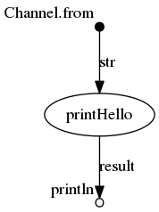

# RNAsplicing-nf
## Nextflow pipeline to perform RNA splicing analyses

[](https://hub.docker.com/r/iarcbioinfo/template-nf/)
[](https://zenodo.org/badge/latestdoi/94193130)


## Description
Runs the SUPPA2 software after recommended data processing of fastq files.

## Dependencies

1. This pipeline is based on [nextflow](https://www.nextflow.io). As we have several nextflow pipelines, we have centralized the common information in the [IARC-nf](https://github.com/IARCbioinfo/IARC-nf) repository. Please read it carefully as it contains essential information for the installation, basic usage and configuration of nextflow and our pipelines.
2. External software:
- trimgalore
- salmon
- SUPPA2

You can avoid installing all the external software by only installing Docker. See the [IARC-nf](https://github.com/IARCbioinfo/IARC-nf) repository for more information.


## Input
  | Type      | Description     |
  |-----------|---------------|
  | input1    | ...... |
  | input2    | ...... |

  Specify the test files location

## Parameters

  * #### Mandatory
| Name      | Example value | Description     |
|-----------|---------------|-----------------|
| --param1    |            xx | ...... |
| --param2    |            xx | ...... |

  * #### Optional
| Name      | Default value | Description     |
|-----------|---------------|-----------------|
| --param3   |            xx | ...... |
| --param4    |            xx | ...... |

  * #### Flags

Flags are special parameters without value.

| Name      | Description     |
|-----------|-----------------|
| --help    | Display help |
| --flag2    |      .... |


## Usage
  ```
  ...
  ```

## Output
  | Type      | Description     |
  |-----------|---------------|
  | output1    | ...... |
  | output2    | ...... |


## Detailed description (optional section)
...

## Directed Acyclic Graph
[](http://htmlpreview.github.io/?https://github.com/IARCbioinfo/RNAsplicing-nf/blob/master/dag.html)

## Contributions

  | Name      | Email | Description     |
  |-----------|---------------|-----------------|
  | Nicolas Alcala*    |            alcalan@iarc.who.int | Developer to contact for support |
  | Ricardo Blazquez Encinas-Rey    |            | Developer |

## References 
SUPPA2 
